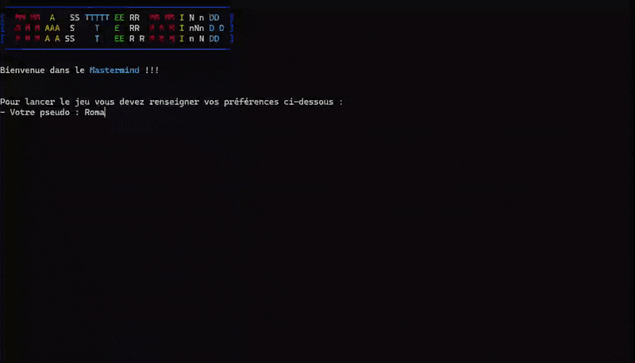

<div align="center">

# 🔴🟠🟡🟢🔵 Mastermind 🟣🔵🟢🟡🟠

[](https://ocaml.org/install#linux_mac_bsd)
[](https://fr.wikipedia.org/wiki/Unix)

</div>

# Qu'est-ce que c'est ?

Le jeu de [Mastermind](https://fr.wikipedia.org/wiki/Mastermind) avec une AI qui gagne à chaque fois ! 🤖


# Comment y jouer ?

Installer la dependance `ocamlfind` avec la commande : 
```bash
$ opam install ocamlfind
```

Compiler le jeu sur votre machine :
```bash
$ ocamlfind ocamlopt -package str -o mastermind -linkpkg Code.ml IA.ml ProjetMastermind.ml
```

Executer le jeu :
```bash
$ ./mastermind
```

Le menu du jeu vous donnera une interface qui ressemble a ça :

